<h1>Controle de estoque JavaFX</h1>

Tela de login              |  Tela de cadastro
:-------------------------:|:-------------------------:
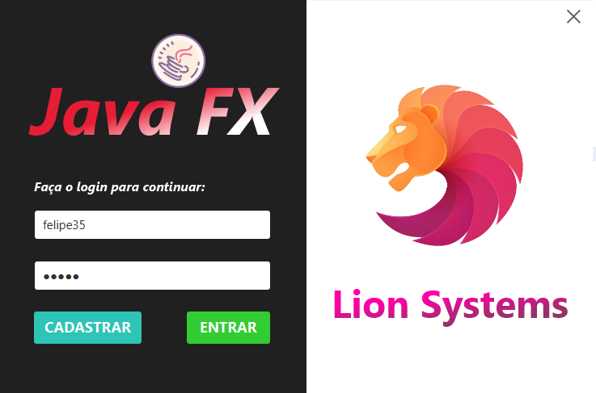  |  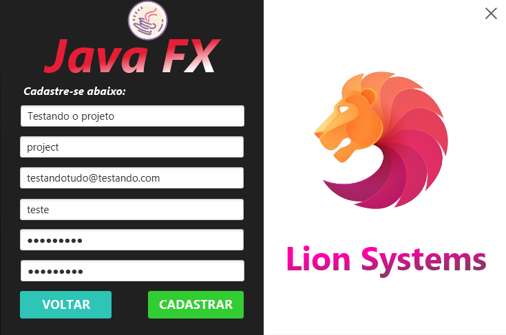

Cadastro realizado              |  Tela Inicial
:-------------------------:|:-------------------------:
  |  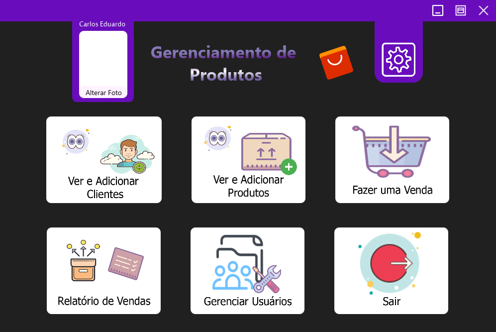

Adicionando foto            |  Tela de configurações
:-------------------------:|:-------------------------:
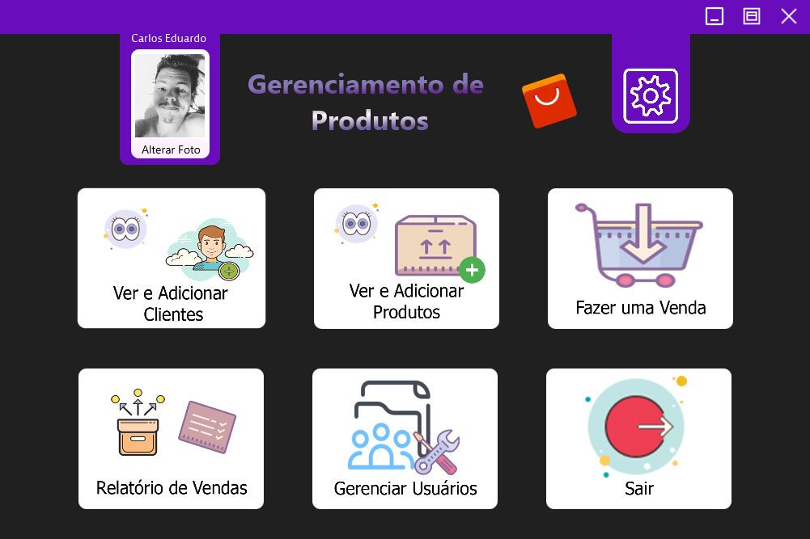  |  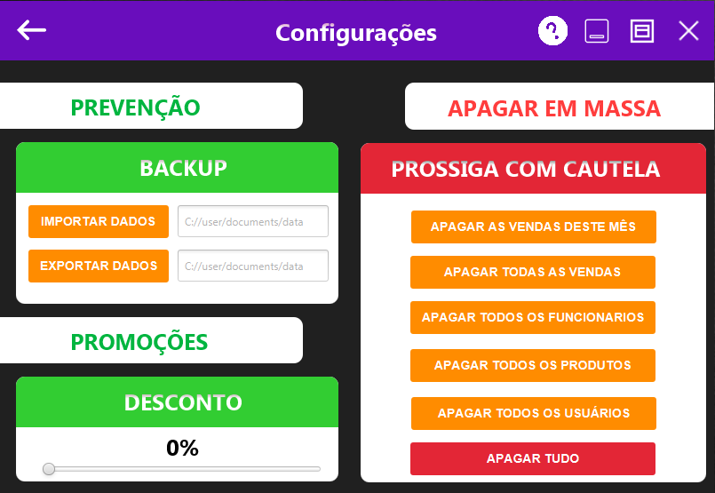

Ver e adicionar clientes       |  Adicionar clientes
:-------------------------:|:-------------------------:
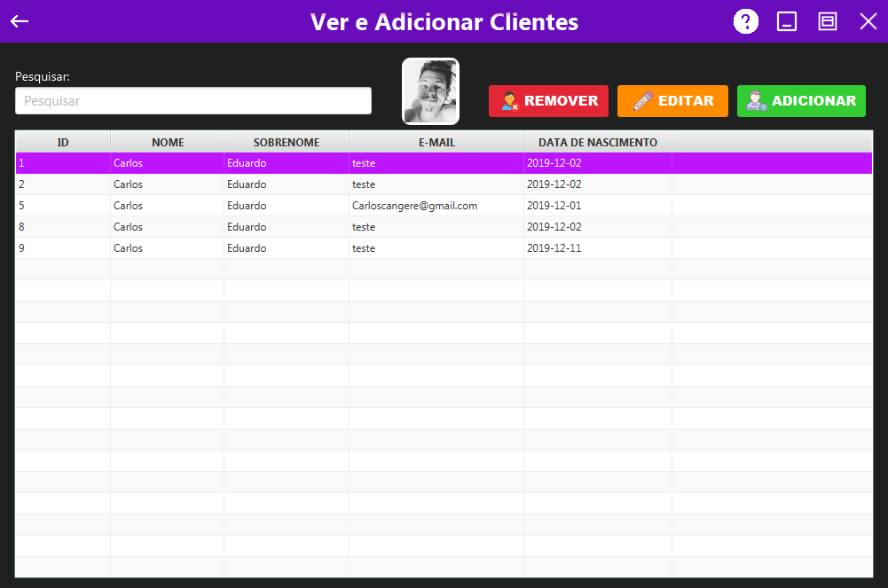  |  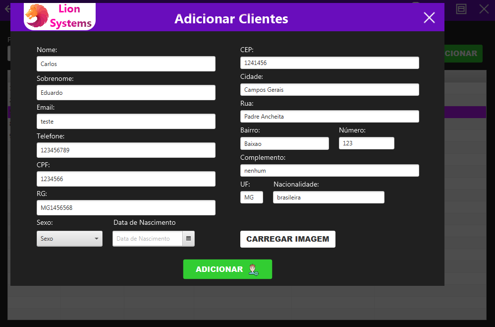

Edição dentro da tabela      |  Adicionar produtos
:-------------------------:|:-------------------------:
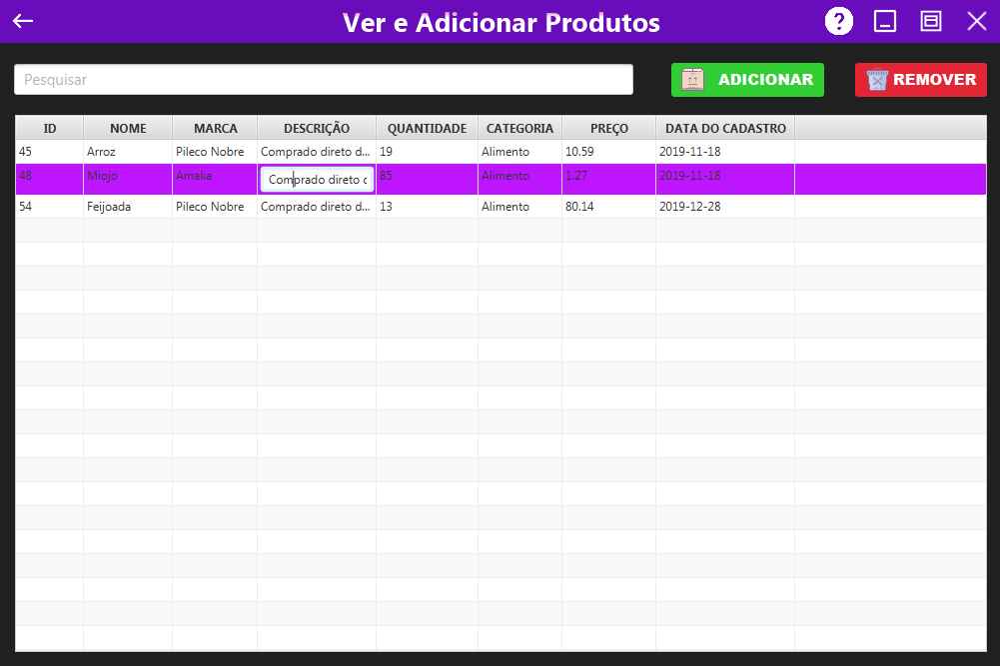  |  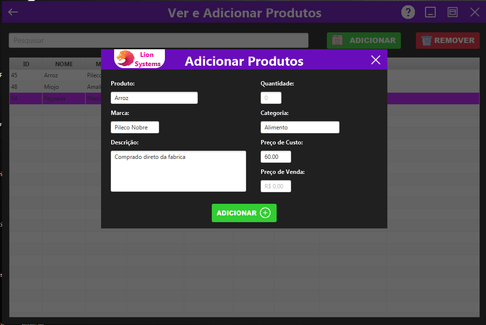

Fazendo vendas e adicionando no carrinho             |  Relatório de vendas
:-------------------------:|:-------------------------:
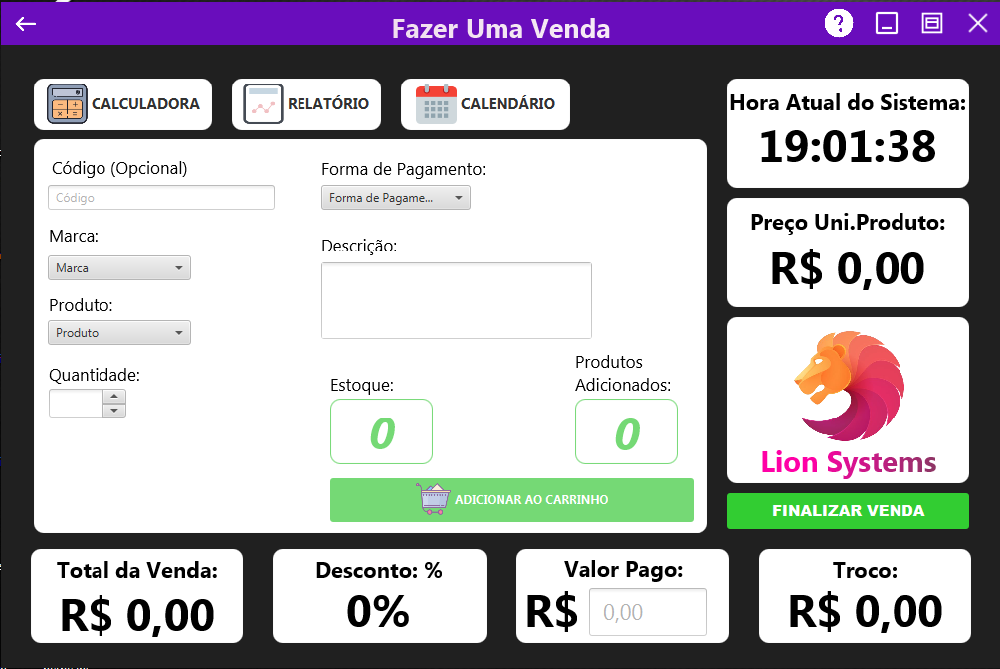  |  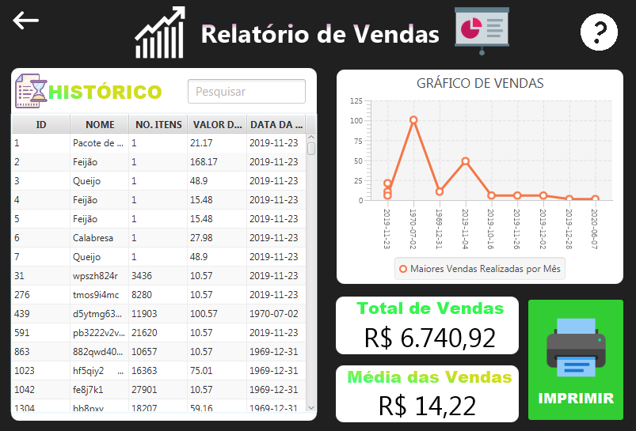

As vendas em ação     |  Gerenciando usuários do sistema
:-------------------------:|:-------------------------:
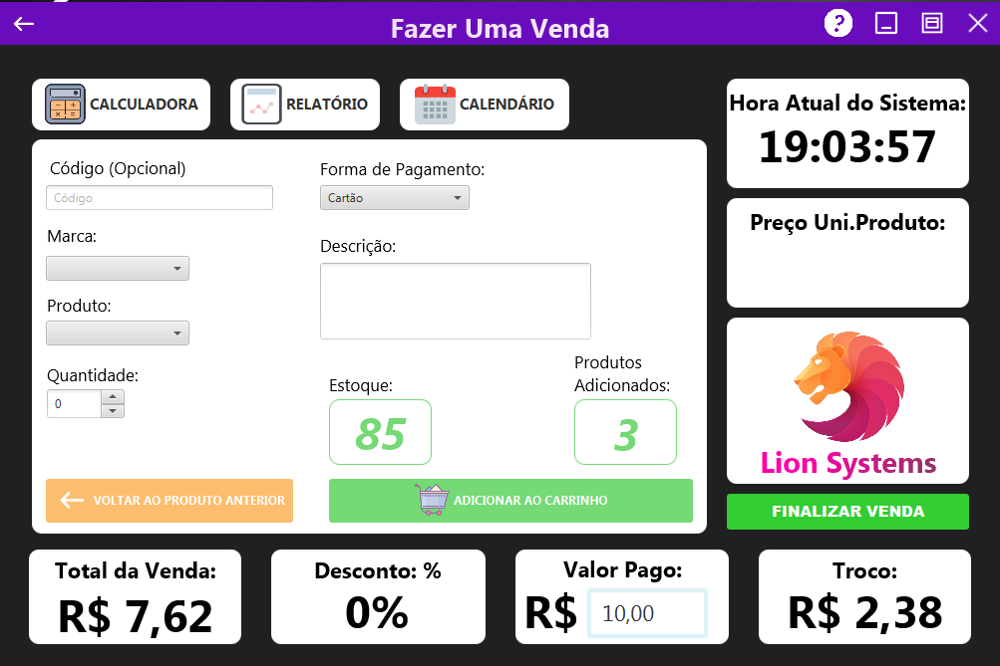  |  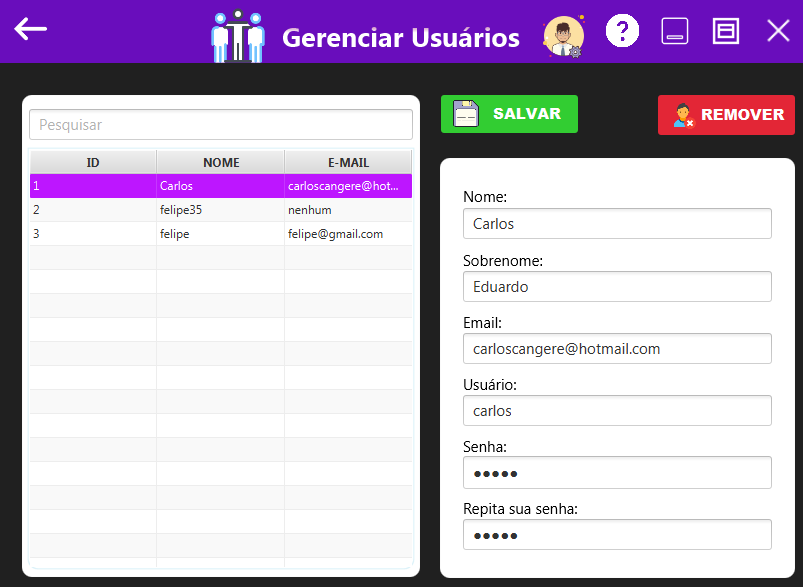

Tela de detalhes do cliente com localização no mapa
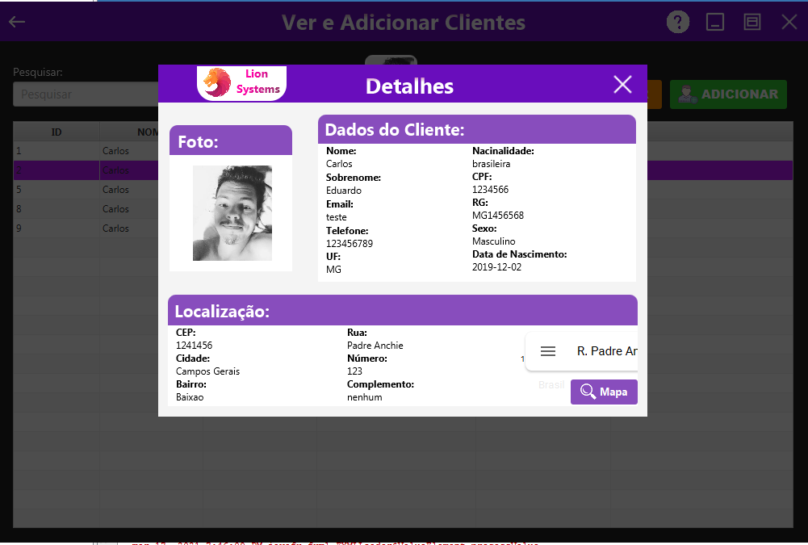

O chat bot que construi usando algumas bibliotecas -> desativei porque o projeto estava ficando muito pesado     |
:-------------------------:|
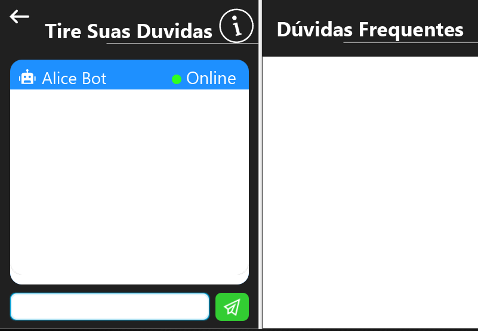

Para instalar este projeto você terá que voltar um pouco ao passado (JDK 10.0.2) 📛:

<ul>
    <a href="https://git-scm.com">Git: 
    https://git-scm.com</a>
     
    <a href="http://netbeans.apache.org/download/index.html">NetBeans 
    http://netbeans.apache.org/download/index.html</a>    
      
     <a href="https://java-2-runtime-environment.br.uptodown.com/windows/download">
    Java
     https://java-2-runtime-environment.br.uptodown.com/windows/download</a>
     
     <a href="https://www.oracle.com/br/java/technologies/java-archive-javase10-downloads.html">
    JDK 10.0.2
     https://www.oracle.com/br/java/technologies/java-archive-javase10-downloads.html</a>
     
     <a href="https://gluonhq.com/products/scene-builder/">
    Scene Builder
     https://gluonhq.com/products/scene-builder/</a>
</ul>

### Rodando o Programa

<ul>
    <li>Caso a IDE acuse algum erro de dependencia os jars estão na pasta "dist/lib".</li>
    <li>Quando os erros de dependencia acabarem tente executar o projeto.</li>
    <li>Se der algum erro de SDK você precisara fechar o Netbeans e ir na pasta "etc" localizada nos arquivos raiz da IDE.</li>
    <li>Chegando lá você tem que abrir o arquivo "netbeans.conf" e adicionar o path do JDK 10 mais ou menos desta forma "netbeans_jdkhome="C:\Program Files\Java\jdk-10.0.2". </li>
    <li>Após os procedimentos você conseguirá rodar o projeto normalmente.</li>
</ul>

### Tecnologias

As seguintes ferramentas foram usadas na construção do projeto:

<ul>
    <li>Java</li>
    <li>JavaFX</li>
    <li>Scene Builder</li>
</ul>

### Autor

<a href="">
 
  
 <b>Carlos Eduardo</b></a>

Feito com ❤️ por Carlos Eduardo

<a href="mailto:carloseduardodiasbatista@gmail.com">Entre em contato</a>

